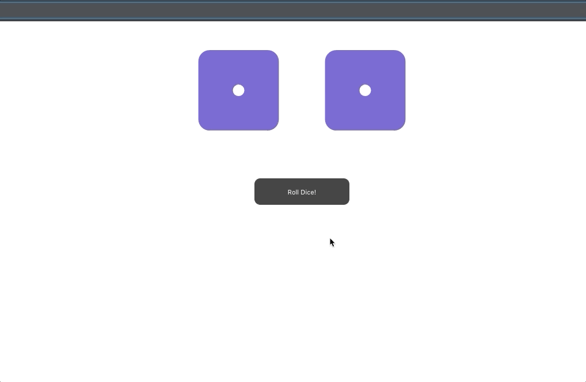

# A React dice rolling application

A React dice rolling application, randomly rolling two dice. Using props and state.

## Using create-react-app

The project was initialized with create-react-app, [Create React App](https://github.com/facebook/create-react-app)

# Instructions to run the application

Run these commands in the project directory: 
Installing dependencies 
`$ npm install`

Starting the application in development mode 
`$ npm start`

This should open the application in the browser, otherwise go to: 
[http://localhost:3000](http://localhost:3000) 
The page will reload if you make code edits.

# Screenshots

Dice rolling

## Author

- Albert Stjärne (https://github.com/AlbertStjarne)
